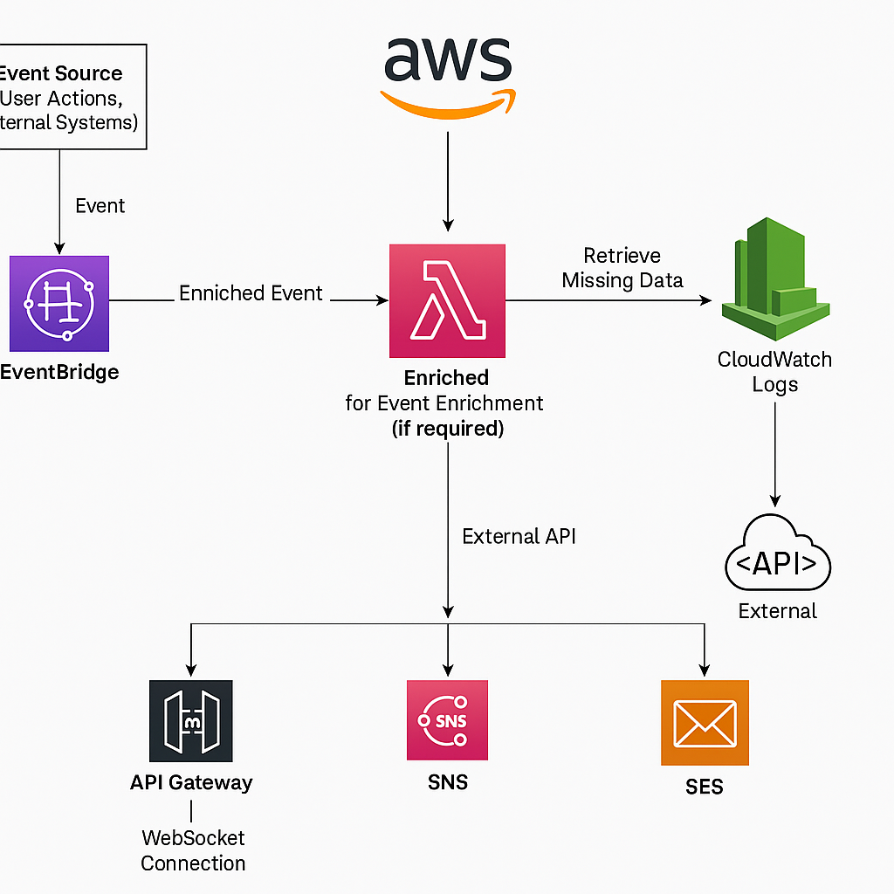

# Event Booking API

This is a Symfony-based REST API that allows users to manage **Events**, **Attendees**, and **Bookings**. The API follows RESTful conventions and uses **JSON** for data exchange.

---

## 📘 API Documentation (Swagger/OpenAPI)

### Base URL

```
http://localhost:8000/api
```

---

## 🎫 Events

### ➕ Create Event

**POST** `/api/events`

#### Request Body
```json
{
  "title": "Symfony Conference",
  "description": "Learn about Symfony",
  "country": "France",
  "capacity": 100,
  "startDate": "2025-05-01T10:00:00",
  "endDate": "2025-05-01T18:00:00"
}
```

#### Response
```json
{
  "id": 1,
  "title": "Symfony Conference",
  "description": "Learn about Symfony",
  "country": "France",
  "capacity": 100,
  "startDate": "2025-05-01T10:00:00",
  "endDate": "2025-05-01T18:00:00"
}
```

---

### 📄 List Events

**GET** `/api/events`

#### Response
```json
[
  {
    "id": 1,
    "title": "Symfony Conference",
    "description": "Learn about Symfony",
    "country": "France",
    "capacity": 100,
    "startDate": "2025-05-01T10:00:00",
    "endDate": "2025-05-01T18:00:00"
  }
]
```

---

### 👁️ View Event

**GET** `/api/events/{id}`

#### Example
```
GET /api/events/1
```

#### Response
```json
{
  "id": 1,
  "title": "Symfony Conference",
  "description": "Learn about Symfony",
  "country": "France",
  "capacity": 100,
  "startDate": "2025-05-01T10:00:00",
  "endDate": "2025-05-01T18:00:00"
}
```

---

### ✏️ Update Event

**PUT** `/api/events/{id}`

#### Request Body
```json
{
  "title": "Symfony Conf 2025"
}
```

#### Response
```json
{
  "id": 1,
  "title": "Symfony Conf 2025",
  "description": "Learn about Symfony",
  "country": "France",
  "capacity": 100,
  "startDate": "2025-05-01T10:00:00",
  "endDate": "2025-05-01T18:00:00"
}
```

---

### ❌ Delete Event

**DELETE** `/api/events/{id}`

#### Response
```json
{
  "message": "Event deleted"
}
```

---

## 🧑 Attendees

### ➕ Create Attendee

**POST** `/api/attendees`

#### Request Body
```json
{
  "name": "John Doe",
  "email": "john@example.com"
}
```

#### Response
```json
{
  "id": 1,
  "name": "John Doe",
  "email": "john@example.com"
}
```

---

### 📄 List Attendees

**GET** `/api/attendees`

#### Response
```json
[
  {
    "id": 1,
    "name": "John Doe",
    "email": "john@example.com"
  }
]
```

---

## 📅 Bookings

### ➕ Create Booking

**POST** `/api/bookings`

#### Request Body
```json
{
  "event_id": 1,
  "attendee_id": 1
}
```

#### Error Responses
- **Event full**: `400 Event is fully booked`
- **Duplicate booking**: `400 Attendee already booked this event`

#### Response
```json
{
  "id": 1,
  "attendee": "John Doe",
  "event": "Symfony Conference"
}
```

---

### 📄 List Bookings

**GET** `/api/bookings/`

#### Response
```json
[
  {
    "id": 1,
    "attendee": "John Doe",
    "event": "Symfony Conference"
  }
]
```

---

## 🔐 Notes

- All endpoints return `application/json`
- DateTime format: `YYYY-MM-DDTHH:MM:SS`
- Validate your requests to avoid error responses.

---

## ⚙️ Setup Instructions

### Requirements

- PHP 8.1 or higher
- Symfony 5.x or higher
- Composer
- Doctrine
- SQLite (or another supported DB)

### Installation

1. Clone the repository:
   ```bash
   git clone <repository_url>
   cd event-booking-api
   ```

2. Install the dependencies using Composer:
   ```bash
   composer install
   ```

3. Create and set up the database:
   ```bash
   php bin/console doctrine:database:create
   php bin/console doctrine:schema:update --force
   ```

4. Start the Symfony server:
   ```bash
   php -S 127.0.0.1:8000 -t public
   ```

The API should now be accessible at `http://localhost:8000/api`.

---

## 🧪 Running Tests

You can run the PHPUnit tests with the following command:

```bash
./vendor/bin/phpunit
```

---

## ⚠️ Troubleshooting

- Ensure your database is set up correctly by running the `doctrine:schema:update` command.
- Check that your routes are correctly registered by inspecting `config/routes.yaml` or using the `php bin/console debug:router` command.

---

Feel free to reach out if you encounter any issues or have questions about using this API.


# Serverless Notification Service

## Overview
The serverless notification service is designed to process events and deliver notifications through multiple channels, including WebSockets, mobile push notifications, and email. The system is event-driven, supports event enrichment, and is built using AWS serverless services. This system ensures real-time notifications and can handle multiple notification channels simultaneously.

## Architecture

### System Components
1. **AWS EventBridge**: Handles the event-driven architecture and routes events based on defined patterns.
2. **AWS Lambda**: Processes and enriches events as necessary before triggering notifications.
3. **Amazon SNS (Simple Notification Service)**: Sends push notifications and WebSocket messages.
4. **Amazon SES (Simple Email Service)**: Sends email notifications with support for templating and multiple languages.
5. **API Gateway**: Manages WebSocket connections for real-time notifications.
6. **DynamoDB**: Tracks active WebSocket connections and stores user preferences.
7. **CloudWatch Logs**: Monitors logs and metrics for debugging and system health.

## Event Processing & Routing
- **EventTrigger**: The system is event-driven, where events trigger notifications.
- **EventBridge**: AWS EventBridge captures the events, and it routes them to the appropriate services.
- **Event Enrichment**: Lambda functions enrich events if they are missing necessary data before processing.

## Real-Time WebSocket Notifications
- **API Gateway**: Manages WebSocket connections for real-time communication.
- **Tracking Connections**: DynamoDB tracks active WebSocket connections to route notifications to connected users.

## Mobile Push Notifications
- **SNS for Mobile Push**: SNS is used to send push notifications to iOS and Android devices.
- **Enrichment for Push**: Event data is enriched before sending notifications to ensure complete messages.

## Email Notifications
- **SES for Email**: SES handles email notifications with support for dynamic templating and multiple languages.
- **Dynamic Content**: Email templates support dynamic placeholders for event-specific content.

## Event Enrichment
- **Lambda for Enrichment**: If an event needs more data, Lambda fetches missing data from external APIs.
- **Pre-processing**: Enrichment happens before the event triggers notifications to ensure all required data is included.

## Logging & Monitoring
- **CloudWatch Logs**: Logs relevant events for debugging and monitoring purposes.
- **Metrics**: CloudWatch metrics monitor Lambda, SNS, SES, and API Gateway health and performance.

## AWS Resources and Configuration
- **EventBridge**: Set up rules to capture and route events.
- **Lambda**: Functions to process and enrich events.
- **SNS**: Topics to send notifications via push and WebSockets.
- **SES**: Email templates for dynamic content and multilingual support.
- **API Gateway**: WebSocket API to manage user connections.
- **DynamoDB**: Track WebSocket connections and user preferences.
- **CloudWatch**: Used for logging and monitoring.

## Sample Event Flow
1. **Event Generation**: A user action triggers an event, such as event registration or a user activity.
2. **EventBridge**: The event is captured by EventBridge and routed based on predefined rules.
3. **Event Enrichment**: Lambda functions are triggered to enrich the event with missing information from external services.
4. **Notification Delivery**: Notifications are sent via the appropriate channels (WebSocket, push, or email) using SNS, SES, or API Gateway.
5. **Tracking**: WebSocket connections are tracked in DynamoDB to ensure the notifications are delivered in real-time.

## Event Enrichment Example
For example, a user registers for an event, but their contact information is missing. Lambda retrieves this information from an external service and enriches the event. The enriched event is then used to send notifications (WebSocket, push, or email).

## Security Considerations
- **IAM Roles**: Proper IAM roles are configured for each service (Lambda, EventBridge, SNS, SES, API Gateway).
- **API Gateway Security**: API Gateway ensures that only authenticated clients can establish WebSocket connections.
- **Encryption**: All sensitive data, including user information, is encrypted using AWS KMS and HTTPS.

## Diagram
The architecture diagram will represent the components, their interactions, and data flow. It will show how events are processed, enriched (if necessary), and routed to different notification channels.

The system architecture is illustrated in the diagram below, which represents the components involved in processing notifications across multiple channels, including WebSockets, mobile push notifications, and email.



## Conclusion
This serverless notification service is designed to efficiently handle event-driven notifications via multiple channels, ensuring real-time updates, enriched event data, and scalable architecture. AWS serverless services are leveraged to handle different aspects of the notification process, ensuring high availability and low maintenance overhead.

